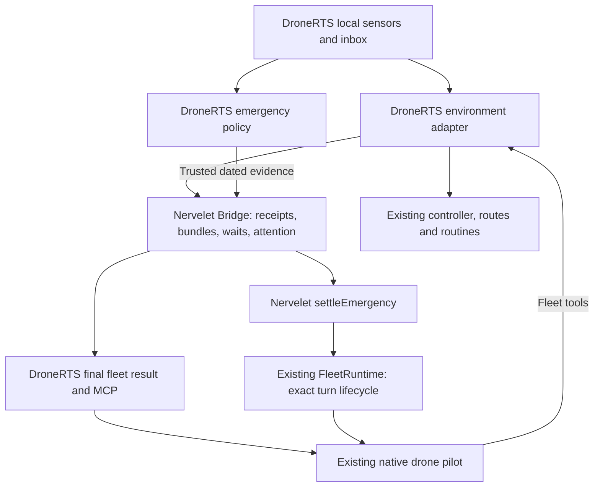

# DroneRTS upgrade plan for the reviewed Nervelet implementation

**Implementation status, September 16, 2026:** applied in the requested worktree; [NERVELET-UPGRADE-QA.md](NERVELET-UPGRADE-QA.md) records the final pin, implementation, tests and native enablement gates. The design text below preserves the reviewed plan and its then-current status.

**Design only.** Based on the actual worktree reviewed in [NERVELET-IMPLEMENTATION-REVIEW.md](NERVELET-IMPLEMENTATION-REVIEW.md), not merely the earlier proposal. The implementation merged during review as `f0c2de60847ab6889c7cc3b95e646f262697861e`, with the same validated source fingerprint. This document specifies application changes against that candidate. It does not change gameplay or enable emergency interrupts today.

## 1. Intended result

Preserve one native pilot, one Nervelet Bridge and one movement writer per drone. The environment keeps sensing and running accepted local work while the model thinks. Ordinary observations remain quiet until the next tool boundary. A qualified emergency may create an earlier ingest opportunity by settling the old harness turn and resuming with fresh evidence.

Adopt upstream improvements without recreating them in DroneRTS:

- Use the unpatched library's payload limits, digest receipts, instruction generator, event packing and attention settlement.
- Keep actor membership, sensors, physical safeguards, private storage, command meaning and emergency selection in DroneRTS.
- Preserve the existing Codex runtime and MCP endpoint. Do not install another Nervelet supervisor or replace native children with a different actor model.
- Implement the safe non-emergency migration first. Enable attention only after its independent gates pass.

## 2. System ownership



`TeamSession` remains the owner of per-drone adapters and role-to-runtime routing. `FleetRuntime` remains the owner of native turns. Nervelet supplies protocol and settlement; it never receives global battlefield state or decides tactics.

## 3. Phase A — replace the private library build safely

### A1. Pin an immutable source/package identity

Use `f0c2de60847ab6889c7cc3b95e646f262697861e` as the reviewed candidate; compare any later upstream changes before changing the pin. Record the final commit, package SHA-256 and lockfile integrity. Version 0.2.0 alone does not distinguish this implementation from the current dependency.

Update [scripts/setup-nervelet.mjs](scripts/setup-nervelet.mjs) to build/pack that exact commit without rewriting library source. Remove both compatibility patches. Keep this small bootstrap while the upstream distribution remains unpublished; delete it only when a reproducible built package is directly available. Do not use an absolute dependency on the author's working checkout or track a moving branch.

Run a fresh isolated install and the deployed/transitive manifest check. Preserve the existing 8 MiB runtime partition and all other quotas. Do not install optional Claude or serial dependencies simply because the package exposes those integrations.

### A2. Add identity-based reconciliation

In [server/nervelet.ts](server/nervelet.ts), implement the actual new method:

```ts
reconcileReceipt(identity, signal) // identity: { id, kind, digest }
```

Resolve the existing original-execution promise by ID; check its recorded kind and, where recorded, canonical digest. Never execute the command again. Honor cancellation while awaiting a result. Missing/unsettled authoritative evidence remains unknown. Keep the original outcome record until it is no longer required for unresolved receipt recovery.

`retainCommandArguments: false` remains enabled. Active route/routine arguments remain in the domain job owner, including source versions needed after compaction. Remove reliance on the old private patch's empty argument object.

### A3. Adopt canonical instructions without changing the fleet API

Configure the new `BridgeOptions.instructions` with:

- `transport: 'tools'`.
- `waitMode: 'hold'`.
- `commandSchemas: 'transport'`, backed by the actual MCP catalog/recovery behavior.
- `refreshTools`: the bounded canonical fleet boundary names, including `observe`, `wait`, `exchange` and direct effect tools. Explain separately that capabilities determine which names are currently callable.

Use the generated text before byte accounting. Remove the post-assembly replacement that discards Nervelet's recovery text. Keep the complete vehicle briefing in `profile.instructions` and canonical command definitions in the profile.

Keep a short **application alias explanation** because the public API differs from generic Nervelet: `mission` means `goalVersion`, `command_id` comes from `nervelet.nextCommandId`, and `seen` comes from `nervelet.id`. This is legitimate adapter documentation, not another generic instruction generator. Do not reintroduce a public `step` tool or a second batching interface.

Compare final normal/recovery output to the current simplified output. Upstream retains command descriptions even when it omits schemas; do not assume the result will be smaller than DroneRTS's current custom recovery text.

### A4. Bound the actual fleet result

Keep the lossless finite-range encoding in [server/observation-format.ts](server/observation-format.ts). Build typed observation objects internally and serialize at the transport boundary where practical, eliminating redundant JSON stringify/parse cycles without moving drone fields into Nervelet.

Use Nervelet's text/media accounting for its own representation, reserve bounded application overhead, and check the actual MCP result after all fleet formatting, capability lists, error/control text and catalog notices. Charge image metadata/wrappers as text and decoded image bytes as media; document the independently bounded HTTP request body.

Do not consume unseen mail or mark a mission bundle as delivered if final assembly fails. Keep preflight validation before effects; if a later result fails after an effect occurred, preserve its receipt for recovery and never retry the mutation automatically. Avoid late overflow by reserving required wrapper/capsule space before selecting events. Final verification remains necessary.

Phase A acceptance: existing adapter tests and game suite pass, maximum escaped 64 KiB file operations still work, lost results redeliver correctly, and manifest quotas remain unchanged. Attention stays disabled.

## 4. Phase B — finish cancellation and native turn bookkeeping

### B1. Propagate camera cancellation

Pass `AbortSignal` from acquisition through `FleetGame.snapshot`, its capture callback and [server/camera-channel.ts](server/camera-channel.ts). Clear the exact pending request and timer on abort, disconnect, timeout or completion. Cancel queued renderer work where supported. Ignore results from abandoned requests, changed renderer identities and obsolete sessions.

An already executing GPU operation may finish; cancellation must prevent its late result from becoming new evidence. One drone's cancellation must not cancel another's image. Capture failure remains explicit missing media. Do not add continuous camera rendering or a frame history as part of this work.

### B2. Track one owned native turn per actor

Extend the existing runtime's per-actor record rather than adding a parallel supervisor. It needs:

- Current thread ID, turn ID and lifecycle state.
- A promise for the matching terminal outcome.
- A bounded registry/count of outstanding tool/result work for that actor.
- One current settlement/resumption promise and its reason.

Only a matching completion can close the current turn. Ignore late old-turn completions for ownership purposes while retaining appropriate diagnostic evidence. Do not equate an interrupt RPC response, a local AbortSignal or `activeTurns.delete` with native termination.

`AttentionTurn.ended` supplied to Nervelet must mean **the matching native turn has ended and its tool/result work is settled**. Track the outer MCP handler, including formatting and catalog processing, not just `Bridge.whenIdle()`. Connect client cancellation and transport failure to the outstanding request's outcome. Record submission and acknowledgement as separate stages.

Catalog refresh, ordinary unexpected endings, explicit Stop/retirement and emergency resumption must share this one ownership record. Emergency resumptions do not spend the unexpected-final allowance, but they do spend explicit emergency and total runtime budgets. Other drones and both mechanical parents are unaffected.

## 5. Phase C — integrate optional emergency attention

### C1. Add the command generation field

When attention is configured, fleet effect schemas accept/require top-level `generation`. The pilot echoes `nervelet.generation`, alongside `seen`, `command_id` and `mission`. Remove these protocol fields before constructing domain command arguments and pass generation to Nervelet's StepRequest.

Illustrative model-facing shape:

```json
{
  "seen": "the-received-bundle-id",
  "generation": 4,
  "command_id": "c12",
  "mission": 1,
  "kind": "fly"
}
```

The action's existing required parameters still apply; this example only shows the protocol fields. Generation comes from actual received output. Never populate it from `bridge.status()` at execution time. If a trusted frozen `effectGeneration` is used, bind it to the originating decision and issue a new binding only after a real fresh-input boundary. A single immutable binding for an entire native turn would incorrectly block later decisions in that same turn after fresh tool results.

Known duplicate receipts remain readable. Existing authorized hover/cancel and Stop paths remain responsive without allowing new ordinary effects from a retired decision.

### C2. Add a small application policy module

Add `server/onboard-attention.ts` only when this phase begins. It receives already acquired, actor-local events and selects ordinary delivery or a trusted emergency request. It owns no loop, planner or sensor store.

It supplies `AttentionEvidence` with a bounded episode key, host-monotonic receipt time, original source acquisition clock/time, factual data and stable references to retained local events. Map the original mailbox cursor to the bridge's epoch-scoped event identity consistently. A raw global match event, arbitrary radio text or model-written “urgent” label is not an authorized sensor trigger.

Configure all actual upstream bounds explicitly: `maxTransitions`, `maxInterrupts`, `cooldownMs`, `terminationMs`, `maxEvidenceAgeMs` and `maxEvidenceBytes`. Start with conservative test-scoped budgets; select production values from measured workloads. Ensure the termination budget covers the combined open-boundary, interrupt, native settlement and reconciliation sequence. Do not confuse host wall time with simulation time.

Upstream requires explicit `rearmAttention(id)` after acknowledgement and cooldown. Rearm from actual domain evidence that the episode has ended or materially changed; do not run a timer that repeatedly rearms an unchanged danger. Budgets remain cumulative. Retain subsequent events while requests coalesce; the first capsule does not become an accumulating event log.

### C3. Wire settlement into the existing runtime

Use `bridge.requestAttention(evidence)` and the exported `settleEmergency` through the role-bound owner. Supply the current native turn's exact ID, terminal-and-tools promise, scoped interrupt function and pending-tool cancellation function.

Handle its actual return values:

| Result | Application action |
| --- | --- |
| `boundary` | Continue the existing turn only through a successfully finalized/submitted fresh tool result; prove that outcome separately |
| `restart` | After rechecking actor/mission/lifecycle/budgets, submit a new turn in the same native session with the fresh observation |
| `inactive` | Do not resume on this request; an overriding lifecycle/goal change may own continuation |
| Error | Retain the gate and evidence, surface the fault, apply the existing explicit failure policy |

Do not let the runtime's ordinary `turn/completed` autoresume race this branch. There is one promise for an actor's transition and one caller that may start the next turn.

**Upstream seam to resolve first:** as reviewed, `boundary` relies on library assembly, not successful host output submission. Add a bounded generic host confirmation/failure path to Nervelet if needed; DroneRTS supplies the MCP evidence. The confirmed callback must not depend on the currently open tool waiting for the same settlement promise, which would deadlock. A failed boundary must fault or take a library-owned qualified interruption path, not silently assume ingestion. Keep attention disabled until this contract and its race tests are clear.

Coordinate the adapter's current fault/reconciliation branch with attention settlement. An attention-cancelled admission can temporarily be unknown before its original execution is reconciled. Do not let the old `ordinary()` error branch stop the whole match before the authorized settlement has had its bounded opportunity. Conversely, do not swallow an unresolved fault to keep the game running. Keep one reconciliation owner for the transition and original-execution records shared with it.

### C4. Resume with actual fresh input, preserving mission and authority

For a restarted native turn, obtain the observation through the same DroneNervelet acquisition/formatting path as normal tools and provide actual image content plus its dated metadata. A generic “continue” prompt followed by another model-selected observe call adds unnecessary latency and is not equivalent to delivering the emergency evidence.

Do not synthesize or replace the mission. Do not run the parents' instruction-forwarding path for a sensor alert. Preserve current job specifications and factual status; the pilot decides any tactical change after ingesting the new data.

An emergency does not itself prove the drone should stop moving. Existing controllers and their finite-range safeguards remain active. Any added automatic physical response needs a separate domain rule and tests. Interruption cannot substitute for collision control or guarantee avoiding the first impact.

The current `TeamSession` refreshes adapters on generic actor-resumed/catalog events. Distinguish attention resumption so this hook does not advance the generation again after the replacement bundle has been built, immediately making that bundle stale. Real compaction/catalog changes still require their own valid recovery.

## 6. Phase D — acoustic sensor experiment

Implement only after Phase C works with synthetic actor-local events. Reuse the feasibility scope in [NERVELET-BOUNDARY-DESIGN.md](NERVELET-BOUNDARY-DESIGN.md): an uncertain local acoustic impulse/possible-shot observation, initially without bearing, range, shooter identity or trajectory.

The module belongs in DroneRTS. World sources produce private stimuli; a finite local sensor model applies propagation delay, sensitivity, obstruction/noise assumptions and imperfect detection before any actor-visible event exists. A global `fired` notification cannot be forwarded as if it were measured sound. The simulator may use hidden source state to generate a sensor measurement; the adapter and attention capsule may expose only that measurement.

Document the approximation and resource cost. Update the versioned sensor profile, actor briefing and manifest. Preserve current projectile physics; it does not justify assuming every shot has a supersonic crack. Do not infer targeting intent from a detected sound. Sensor thresholds and attention usefulness need separate tests.

No automatic targeting, evasive route or new shared world model is part of this module.

## 7. File-level scope

| Existing/new application file | Change |
| --- | --- |
| `scripts/setup-nervelet.mjs`, package/lock files | Exact upstream identity, remove source patching, reproducible package |
| `server/nervelet.ts` | `reconcileReceipt`, instruction configuration, generation mapping, fresh resumption input, bounded output integration |
| `server/runtime-tools.ts` | Short alias explanation and generation schema/instructions |
| `server/observation-format.ts` | Typed final encoding and actual output-size checks |
| `server/game.ts`, `server/camera-channel.ts`, browser capture handler | End-to-end scoped cancellation and honest image outcomes |
| `server/runtime.ts`, `server/runtime-mcp.ts` | Exact turn correlation, outstanding tool/result settlement and one continuation owner |
| `server/team-session.ts` | Role-bound policy routing; separate attention resumption from generic refresh |
| `server/onboard-attention.ts` — proposed | Small domain policy; generic transitions remain in Nervelet |
| Acoustic sensor module — later | Local measurement generation and declared uncertainty |
| Existing tests, actor briefing and package manifest | Migration regressions, new race tests, resource and sensor knowledge accounting |

Do not split every concern into a new service/class. Extend the existing adapter, runtime and camera channel; add a policy/sensor module only where it has a real distinct domain responsibility.

## 8. Validation and rollout

1. **Pin and upgrade with attention off.** Run relevant adapter tests, the required game suite and build; fresh install and manifest check. Confirm 128 KiB event slicing, 64 KiB escaped files, exact goals, launch gating, six private actors and current quotas.
2. **Cancellation and lifecycle fixtures.** Cancel during camera/native I/O and after bridge assembly; prove no stale image/effect or duplicate actor resume. Inject old/out-of-order native completion events and MCP errors. Check that other pilots keep running.
3. **Attention fixtures.** Reasoning, held wait, command admission, slow capture, failed final result, inbox backlog, natural completion, catalog refresh, compaction, new objective, Stop/reset and death. Verify same-session/goal resumption and old-generation rejection after new acknowledgement. Preserve value conservation and receipts.
4. **Bounded native qualification.** Only in a separately authorized gameplay/QA run: inspect `/api/state`, preserve port 4317, use a free isolated trial port, six native Luna/xhigh pilots and an actual camera browser. Establish real tool/result pairing and terminal settlement before enabling emergency behavior in ordinary matches. Stop all owned actors/helpers afterward.
5. **Mission and sensor qualification.** Pass current single haul, repeated haul and useful team haul gates. Test acoustic detection and attention usefulness separately; full battle follows those gates, not deterministic protocol success alone.

Measure detection → request → old turn ended → fresh input submitted → first useful new action. Also measure ordinary input age at action, false/unhelpful interruptions, coalescing, completed work, observable tokens/cost, CPU/peak RAM, event-loop delay and actual final bytes. Count local braking separately from model response.

Attention remains an explicit capability/configuration choice per new match. If it is not qualified or encounters an unresolved lifecycle fault, do not silently substitute a provider or claim emergency responsiveness. Roll back via a new stopped/reset session using the previous pinned dependency; never swap protocol implementations inside a live match.

## 9. Deliberate deferrals

- Managed parking for idle pilots: existing Nervelet capability, separate actor-lifecycle migration after this path is stable.
- Checkpoints: use existing support only when real compaction evidence warrants it.
- Numeric wait snapshot projection: not implemented upstream; profile before adding a new interface.
- Continuous camera acquisition: no demonstrated benefit for the present boundary-only visual consumer.
- Controller collision changes: the existing opposing-motion issue remains independent work; this upgrade does not fix it.

The intended improvement is a simpler maintained dependency, less repeated boundary work, complete cancellation and optional measured emergency responsiveness. It is not a claim that a sequential model becomes a real-time controller or that current DroneRTS autonomy has been qualified.
