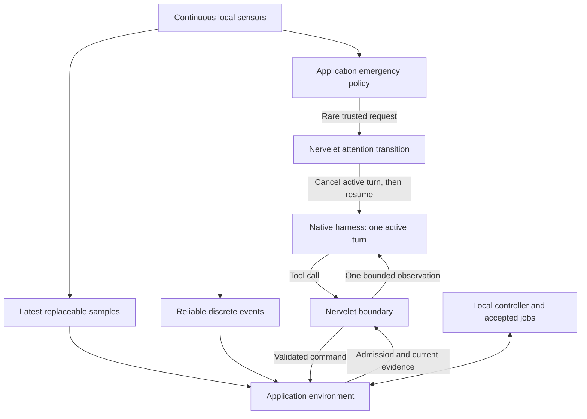

# Nervelet and DroneRTS: efficient boundaries and emergency attention

**Follow-up:** the library work now has an [implementation review](NERVELET-IMPLEMENTATION-REVIEW.md) and a [DroneRTS upgrade plan](DRONERTS-NERVELET-UPGRADE.md) based on its actual APIs. This file preserves the original proposal; use those documents for current migration work.

**Status: proposed design, not implemented.** This document incorporates the user's clarification that normal sensing must respect the harness's ingest → reason/act → ingest cycle, while genuine emergencies may interrupt an active turn and request a new response. It proposes library changes first and application modules only where the behavior depends on DroneRTS.

Reviewed baseline: Nervelet 0.2.0 at `2a806a61b5d9cc2dc48029bb9818bd228c8aba25`; DroneRTS worktree based on `7379731b4869beb25412ff0cee4d7a0d970b6662`, including the uncommitted integration and simplification described in [NERVELET-INTEGRATION.md](NERVELET-INTEGRATION.md) and [NERVELET-SIMPLIFICATION.md](NERVELET-SIMPLIFICATION.md). No runtime changes or inference trials are part of this document.

## 1. Decision in plain English

Nervelet is the reliable handoff between a continuously running environment and an agent that only reads inputs at discrete boundaries. It should make that handoff cheap, current and recoverable. It should also provide an optional, bounded emergency interrupt mechanism.

DroneRTS supplies the sensors, decides which measurements constitute emergencies, and owns what the drone physically does while its pilot is unavailable. Nervelet must not know what a drone, shot, cargo load or safe maneuver is.

The proposed changes are:

1. **Generalize the existing packaging, input-size and receipt-storage fixes in Nervelet.** Remove the private patched build from DroneRTS once an upstream release is qualified.
2. **Generate the right instructions once in Nervelet.** Reflect the actual tool surface and waiting mode; avoid duplicating a catalog already supplied by the transport.
3. **Make bounded observation assembly cheaper in Nervelet.** Preserve exact data and acknowledgements while avoiding repeated serialization of the growing bundle.
4. **Add a complete emergency attention path to Nervelet.** Reuse native interruption primitives, invalidate stale pending effects, await the old turn's end, and resume the same mission with fresh evidence. Ordinary sensor updates never take this path.
5. **Finish cancellation and observation construction in DroneRTS.** Honour Nervelet's existing cancellation contract down to the browser request; keep drone formatting and physical checks local.
6. **Prototype a local acoustic alert module in DroneRTS.** If qualified, its measurements can request Nervelet attention. It must not expose a global gunfire notification or shooter location.

Managed parking and checkpoints already exist in Nervelet. They are optional adoption work, not reasons to build another library loop. A cheaper numeric-wait snapshot is a later, measurement-gated extension.

## 2. Operating model

### Normal path



The harness remains sequential. Environment I/O and accepted jobs continue while the model reasons. Normal updates replace old sample values or enter the reliable event queue; they do not inject text into private reasoning, restart a turn, or queue a model response for every sample.

At the next normal boundary, the bridge acknowledges the previous received bundle, validates/adopts commands, optionally waits, acquires required media, reads current state and events, and returns a bounded result. The image and newer telemetry may have different acquisition times. Assembly time is not acquisition time or proof of model receipt.

An emergency creates a new legal ingest opportunity by ending the old turn first. It does not make the harness concurrent. Interruption can discard useful work and increase latency/cost, so it is exceptional and disabled unless configured.

### Three kinds of input

| Input | Storage and delivery rule | Owner |
| --- | --- | --- |
| Replaceable measurements: current pose, range sample, streaming camera frame | Keep the newest available value per source, with actual acquisition/receipt time and validity. Do not accumulate a backlog of obsolete frames. | Environment; optional Nervelet `ObservationStore` helper |
| Discrete facts: delivered message, completed job, detected acoustic impulse | Retain bounded reliable events until the included slice is acknowledged; apply explicit backpressure. | Existing environment event store; Nervelet owns delivery bookkeeping |
| Emergency attention | One bounded pending attention record tied to real evidence; coalesce requests to interrupt, not the underlying reliable events. | Nervelet mechanism, application selection |

A transient condition that matters must become an event at acquisition time. Latest-value coalescing cannot promise to preserve every threshold crossing. The adapter decides whether a crossing is meaningful; the core does not infer domain semantics.

Continue sending complete compact current state. Do not introduce cross-bundle deltas that require the model to remember a discarded baseline. DroneRTS's existing lossless range codebook and references within a single bundle remain application formatting.

## 3. Ownership at the seam

| Concern | Nervelet | DroneRTS |
| --- | --- | --- |
| Observation protocol | Bundle identity, generation, receipts, event inclusion/acknowledgement, generic budgets | Own telemetry, camera pose/calibration, finite ranges, equipment, cargo, available commands |
| Acquisition | Optional store/notification interfaces; dated typed attachments | Acquisition rates, source validity, camera renderer, physical sensor model |
| Execution | Validate generic protocol and command schemas; preserve uncertainty and deduplication | Atomic command admission, resources, movement writer, routes, QuickJS, purchases and services |
| Normal waiting | Conditions, deadlines, lost-wake protection, optional managed parking | Declare legal numeric fields and publish relevant changes |
| Emergency selection | Accept only a trusted host request; no built-in shot or robot classifier | Determine whether actual local evidence warrants attention |
| Emergency transition | Gate stale new effects, coalesce requests, coordinate interruption/restart, require fresh acknowledgement | Supply actor binding and existing native turn owner; apply domain job policy |
| Physical response | Call declared controls; report confirmation/unknown faithfully | Continue, brake, cancel or stop according to current valid local sensing and explicit policy |
| Native harness integration | Codex/Claude modules normalize supported lifecycle operations | Preserve the six isolated pilots and two mechanical relays; use the existing process/session owner |
| Recovery | Exact goal, current state, active jobs, optional note and acknowledgement gate | Vehicle briefing, active route/routine arguments and source versions |
| Presentation | Generic protocol instructions for the actual transport and tool mode | Drone field encoding, units, visibility rules and game-specific descriptions |
| Measurement | Bounded generic lifecycle and delivery traces | Match outcome, reaction usefulness, collision/conservation checks and application accounting |

**Abstraction test:** a library feature must also make sense for an API monitor with no camera or actuator. An emergency may be a machine fault, a safety interlock or an API incident. Its payload and consequences remain environment-defined.

There is one owner per resource. Do not add another event database, controller, model, process supervisor or copy of the application sensor store. Do not run Nervelet's full supervisor alongside DroneRTS's existing actor supervisor.

## 4. Existing capability versus required work

| Capability | Actual baseline | Proposed work |
| --- | --- | --- |
| Latest samples and reliable events | Already supported by Nervelet; DroneRTS wraps its existing stores | Preserve; no new store |
| Conditional waits and managed parking | Both exist; DroneRTS uses held waits only | Keep held waits initially; qualify parking separately for idle actors |
| Native interruption | `AgentDriver.interrupt()` exists for Codex and Claude; DroneRTS uses native interruption for stop/retirement | Complete emergency request, settlement, resumption and budgeting semantics |
| Same-goal emergency resumption | Nervelet supervisor currently errors on an interrupted turn without a new goal | Add an explicit authorized emergency reason; never invent a goal change |
| DroneRTS resumption | Ordinary unexpected endings count toward a small failure limit | Recognized emergency restarts need their own bounded category |
| Abortable acquisition | Nervelet passes `AbortSignal`; DroneRTS guards late results | Carry cancellation through the camera request and queued renderer work |
| Recovery presentation | Nervelet serializes a full profile; DroneRTS replaces recovery text after assembly | One canonical transport-aware renderer before budgeting |
| Large command limits / argument retention | Two private source patches in DroneRTS's Nervelet build | Public opt-in library options with unchanged defaults |
| Efficient bundle packing | Core reserializes the whole growing event bundle for each candidate event | Exact incremental byte accounting with a final verification |

The low-level native interruption methods are not proof that the complete emergency behavior works. In particular, Claude's current driver does not expose a fully qualified distinction between every SDK cancellation result and failure. Both native drivers need interruption/resumption tests on the actual supported versions.

## 5. Nervelet changes

### N1. Publish the existing compatibility options

Upstream `maxRequestBytes`, `maxCommandBytes` and `retainCommandArguments`, retaining current defaults. Apply input bounds consistently through core, shared handlers and relevant transports. The current handler also has a hardcoded request ceiling, so changing the core alone is insufficient for a general release.

When arguments are not retained, keep command identity and payload digest. Authoritative reconciliation must still be available by command ID; a missing original result remains unknown and gates effects. Active job specifications remain environment-owned. Never remove unresolved receipts to admit more work.

Ship built exports in a normal versioned package and test an install outside the source checkout. DroneRTS then pins that release, removes its private patch/build path, and remeasures the actual dependency manifest. No quota increase follows from upstreaming.

### N2. One canonical presentation contract

Extend the existing instruction generator with a small host-declared description of:

- Which exposed tools constitute observation boundaries.
- Whether typed command schemas are already supplied by the transport.
- Whether the active integration uses held waits or managed parking, using the existing wait-mode configuration.

Generate the ordinary reminder and recovery instructions from this same description. CLI defaults remain valid; DroneRTS can declare that its fleet tools refresh inputs and that a held wait does not require ending a turn.

All required operating instructions, units, calibration, exact goal and recovery job records remain available. Omit duplicate command schemas only when the host guarantees the matching catalog is present, including after native recovery. A profile hash is not a substitute for instructions.

Budget the representation actually generated, rather than a larger temporary representation that an adapter rewrites afterward. Transports must check/count their final wrappers too. Native token caching is a possible downstream benefit, not a promised outcome of smaller byte counts.

Avoid a general template/plugin system. A few typed presentation options and one renderer are enough.

### N3. Linear work for bounded event packing

In `Bridge.bundle`, each candidate event currently serializes the base bundle plus every already selected event. This repeats large state/recovery text and does increasing work as the event slice grows.

Measure the fixed text projection once, encode each candidate event once, account exactly for JSON punctuation and metadata, then perform one final size verification. Use the same representation as the transport; image bytes remain a separate bound. Preserve ordering, stable IDs, the included high-water cursor, `hasMore`, and all capacity errors. Do not truncate required state, hide events, or acknowledge anything during packing.

This is an internal optimization with no new public API. Test Unicode, escapes, base64 metadata, empty slices, exact limits, recovery and a maximum-sized DroneRTS file result. Compare work counts and allocation/CPU measurements; do not infer model speed from a serializer benchmark.

### N4. Optional emergency attention

Add a trusted host API, conceptually `bridge.requestAttention(request)`, and expose its pending state to the existing continuation owner. This is not an agent-callable tool and cannot be triggered merely by text saying “urgent.” Names below describe the contract, not a finalized implementation API.

The request contains an environment event reference, a bounded reason code, an episode key, dated evidence and an optional expiry for interruption eligibility. The environment supplies factual data, not a replacement system prompt or new mission. Emergency handling is disabled by default. Configuration explicitly enables it for qualified host/driver bindings.

#### Sequence

```mermaid
sequenceDiagram
    participant S as Local sensor
    participant A as Application policy
    participant N as Nervelet
    participant H as Native turn owner
    participant D as Domain controller
    S->>A: Dated local measurement
    A->>A: Retain event; classify attention need
    A->>N: Trusted emergency request
    N->>N: Latch evidence and gate stale new effects
    A->>D: Apply explicit local policy, if needed
    N->>H: Request interruption of current turn
    H-->>N: Matching old turn has actually ended
    N->>N: Reconcile uncertain effects; acquire fresh bundle
    N->>H: Resume same session and goal with evidence
    H->>N: Next tool acknowledges new bundle
    N->>N: Enable newly decided effects
```

Reuse the existing recovery generation and acknowledgement gate initially. One accepted emergency episode advances the generation once; repeated observations within that episode do not repeatedly invalidate recovery. A later accepted episode is a new transition. Keep the exact goal and its version unchanged.

`refresh()` alone is insufficient: it advances the generation but does not by itself finish all cancellation and native-turn coordination. The attention transition must also invalidate old operation contexts and abort affected pending tool work. Any effect that might already have occurred is reconciled against the original execution, never automatically retried.

For attention-enabled sessions, each new effect must cite a delivered bundle from the current generation, even after the recovery gate has opened. A global “recovery acknowledged” flag alone is insufficient: a delayed old-turn request must still fail after the replacement turn acknowledges its new bundle. Bind in-flight tool work to the originating turn/generation where the transport exposes it, and settle the old tool lane before restarting. Known duplicate receipts remain readable without executing again; immediate authorized Stop/cancel retains its control path.

#### Behavior by current state

| State when attention arrives | Required behavior |
| --- | --- |
| Harness actively reasoning | Request native interruption, wait for that turn's terminal notification/result, then submit fresh evidence |
| A held wait is open | Wake it with the emergency evidence; use that legal ingest boundary where possible, without an unnecessary cancel/restart |
| A command or capture is pending | Invalidate stale effects, settle/cancel pending I/O, retain uncertain receipts; use the qualified driver path without breaking tool/result pairing |
| Native turn is already closing | Latch the request and resume once after closure |
| Operator is parked or idle | Wake/resume once; there is no active thinking to interrupt |
| Stop/death/session closure | Suppress emergency restart; normal lifecycle shutdown wins |

An interrupt RPC returning successfully means the request was accepted, not that the old turn ended. Do not start another turn until the matching native lifecycle result establishes completion. If that cannot be established within the configured deadline, report a fault, keep new effects gated and apply the application's declared failure policy. Never create a replacement actor or switch models as a silent workaround.

Explicit operator Stop, death and revoked authority bypass ordinary attention cooldowns. An acoustic alert is not operator Stop. It must not automatically cancel every valid route or invent an evasive maneuver. The application separately declares which jobs continue or stop; that decision is reported in the next bundle.

#### Bounded interruption, reliable evidence

- One pending attention transition per operator. Coalesce repeated requests by a trusted application episode key.
- Configure an interrupt budget and rearm/cooldown policy; do not encode a universal robot-specific duration in core. Require a fresh decision opportunity before repeated same-episode interruption.
- During cooldown, keep new measurements/events available. Suppression of another interrupt is not suppression of evidence. Persistent danger still follows local physical policy.
- Count cancelled/restarted turns against time and available usage budgets. Emergency authorization is separate from unexpected-final retries, not an unlimited bypass.
- Stale emergency requests may lose permission to interrupt but remain dated historical events. Sensor data and notes cannot confer goal or control authority.
- Add capability reporting for interruption/settlement. Unsupported or unqualified bindings are explicit; they can deliver at normal boundaries but cannot claim emergency preemption.

An urgent event can sit behind a normal inbox backlog. Do not reorder the reliable queue or advance its cumulative acknowledgement past unseen events. Reserve a **bounded attention capsule** in the next observation: factual emergency data and references to the original event, outside the normal FIFO slice. Proposed ceiling: 1 KiB and one active episode, charged to the existing cache/text budgets. This is a small explicit duplicate of urgent evidence, not another event queue. Acknowledging the capsule can clear the attention gate, but consumes only the ordinary included FIFO slice. The original event may consequently appear again later under the same identity.

If even the capsule cannot fit, fault explicitly; do not silently omit the reason for interruption. Future out-of-order event acknowledgements are unnecessary for this design.

#### Integrating existing hosts

Extend Nervelet's existing supervisor to recognize an authorized same-goal emergency and use its current single-turn lifecycle. Extract only the small interrupt/settlement helper needed by borrowed hosts; do not create a new scheduler package.

DroneRTS's existing `FleetRuntime` remains the continuation owner. It binds that helper to the authenticated drone's thread/turn, routes native completion events, and calls the same bridge attention transition. Its generic `resumeActor` handler must not race the emergency handler or count intentional emergencies as unexpected finals. Other pilots and both relay parents keep running normally.

### N5. Generic measurement before further optimization

Extend the existing bounded trace surface, not a new telemetry service. Record known times and correlations for boundary start, capture/assembly duration, attention requested/coalesced, interrupt requested, old turn ended, replacement input submitted, fresh bundle acknowledged and command admitted.

Keep acquisition, receipt, assembly, transport submission and acknowledgement distinct. Host monotonic time measures scheduling; device/simulation time remains source-labelled. Do not read private reasoning or call an observed next-tool gap pure model compute time.

Track final text/media bytes, snapshot/serialization work, queue high-water marks and observable usage. Diagnostics must not block control or leak one actor's data into another actor's context. Unsupported native usage measurements remain unavailable.

### N6. Defer a narrow snapshot hint until measurements justify it

DroneRTS's ordinary idle waits already avoid tick snapshots. Numeric waits still construct full snapshots when evaluated. If this is material under six actors, extend the existing `snapshot(after, signal)` with an optional purpose/field-selection hint for internal wait evaluation. Existing adapters ignore it and remain correct.

The requested fields must be profile-declared, dated and valid; faults and the relevant event/job checks remain present. A wait snapshot never captures images or drains events. Final model-visible observations remain complete. Keep one snapshot contract and existing change-sequence race protection, rather than adding a parallel query service or topic broker.

## 6. DroneRTS modules and changes

### D1. Finish acquisition cancellation and construction

Thread the existing abort signal through `FleetGame.snapshot`, the camera callback and `CameraChannel.capture`. Cancellation removes the pending request/timer and cancels queued browser work when supported. A GPU render already in progress may be non-preemptible; its late output is ignored and cannot overwrite current evidence. All cleanup is request-scoped, never another drone's capture.

Keep capture deadlines and explicit missing-image output. An emergency's fresh image attempt must be bounded; a failed attempt must not hold emergency delivery indefinitely or reuse an old frame as fresh. Do not add continuous camera encoding merely to prepare for a possible interrupt.

Construct observation data as typed objects internally and serialize at the transport edge where practical. The current path repeatedly builds/parses JSON tool results before the final lossless range formatter. Simplify within the existing observation code; do not introduce a generic serializer framework into Nervelet.

This module keeps DroneRTS's camera-at-tool-boundary policy. Other Nervelet consumers may already have a real streaming camera and supply its latest frame through the existing acquisition contract.

### D2. Drone-specific attention policy

Keep a small pure policy next to the adapter, conceptually `server/onboard-attention.ts`. It takes already acquired local events and returns ordinary delivery, wait wake, or a trusted emergency request. It contains no LLM and no tactics.

It owns sensor-specific thresholds, confidence/quality requirements, episode grouping and rearm decisions. It maps app-specific evidence into Nervelet's generic request and chooses any independently justified local job response. Radio text alone does not gain emergency authority; an operator's explicit Stop continues through the existing authorized control path.

The policy must not cancel all flight merely because a loud sound is heard. Initially keep valid local work running unless existing finite-sensor/controller rules require stopping. Tactical changes remain the pilot's decision after fresh ingestion. Any later automatic protective maneuver is a separate domain design and test, not hidden Nervelet behavior.

### D3. Acoustic impulse sensor feasibility module

**Feasible in principle, not yet a qualified DroneRTS sensor.** Research has recorded gunshot signals using microphone arrays aboard flying multirotor drones; rotor noise is a significant measurement problem. That supports investigating a local acoustic alert, not claiming reliable detection or localization under this map's conditions. See the [2019 experimental study](https://pubmed.ncbi.nlm.nih.gov/31581585/).

Start with a deliberately narrow sensor: a dated, uncertain local impulsive-sound detection, optionally classified as a possible shot by a documented detector. Do not initially add bearing, range, shooter identity or a location estimate. Detecting a sound does not prove it was aimed at this drone.

Proposed separation:

1. **Simulation source:** the world emits a private acoustic stimulus when an appropriate physical source fires. Internal source identity/position is used only to simulate propagation, as geometry is used to simulate a range sensor.
2. **Local transducer model:** evaluate the stimulus at the receiving drone with finite sensitivity/range, propagation delay, declared obstruction/attenuation assumptions and rotor/ambient noise. A source's global `fired` event is not itself a sensor reading.
3. **Detector:** derive a bounded local observation from the simulated signal/features. Preserve missed detections, ambiguous impulses and false alarms; do not substitute perfect ground-truth classification.
4. **Application policy:** decide whether that observation merits an interrupt. Pass only its actor-visible evidence to Nervelet.

The first implementation may use a documented signal-feature approximation rather than full audio synthesis. It must declare that approximation, its sensitivity assumptions and its failure cases. Do not attach physical units or calibrated probabilities to arbitrary game scores. Require a new versioned sensor profile and account for acquisition/processing/storage costs; update the vehicle briefing before exposing it to pilots.

Example output shape, illustrative only:

```json
{
  "kind": "acoustic_impulse",
  "source": "onboard-acoustic",
  "acquired": {"clock": "simulation", "ms": 120340},
  "valid": true,
  "classification": "possible_shot",
  "quality": "uncertain"
}
```

The host also records monotonic receipt/detection times. Event data contains no shooter/team/projectile identity, hidden impact location or invented trajectory. Normal friendly/own sounds must be handled using physically available signals and the drone's own known actions, not a hidden enemy-team filter.

**Important compatibility finding:** current projectile muzzle speed is 32 simulation units/s, or 320 m/s. This is below the roughly 343 m/s sound speed of ordinary room-temperature air, so we cannot assume every current shot produces a supersonic ballistic crack. Start from muzzle impulse detection; do not silently change projectile physics to justify a sensor. Sound may also arrive too late to warn about the first impact. [Current projectile configuration](shared/rts.ts), [projectile creation](server/rts.ts), [NASA sound-speed reference](https://www.jpl.nasa.gov/news/what-sounds-captured-by-nasas-perseverance-rover-reveal-about-mars/).

Implement the acoustic experiment after the generic attention path works with synthetic local events. Qualify sensor plausibility and interruption usefulness separately. No automatic aiming, shooter localization or counterfire belongs in this work.

### D4. Preserve the existing domain safeguards

DroneRTS continues to own final command preconditions, one movement writer, controller leases, finite-range braking, cargo conservation, private files, native transports and actor isolation. Emergency interruption does not confer new sensing or command authority.

Freshness required for a particular command belongs here. Retain the distinction between a valid delivered observation ID and sufficiently recent evidence for the action. Do not add a blanket two-second age rejection: observed model gaps are often longer, and different operations have different requirements. Define and test any command-specific admission rule separately.

## 7. Resource and simplicity constraints

- No new background model, per-frame model wake, general priority broker, memory database or second sensor acquisition owner.
- Keep optional attention machinery dormant when disabled. Ordinary consumers should retain current behavior and dependencies.
- Keep the normal queue FIFO and acknowledged; an emergency capsule does not redesign event delivery.
- Keep the existing local controller/job architecture. Nervelet reports execution; it does not become a robotics planner or autopilot.
- Account for attention metadata, sensor state, traces, package code and transitive assets inside DroneRTS's current allocations. Preserve the distinction between the 16 MiB logical storage split and actual process RAM.
- Do not stream or persist raw audio/video by default. If a future detector needs windows or clips, declare bounded buffers and who consumes them.
- Keep exact known goals and required recovery instructions. Reduce duplication, not information required for correct operation.

## 8. Implementation order and acceptance

### Stage 1 — upstream small fixes and establish measurements

Implement N1–N3 and N5 in Nervelet, with API-only and robot-shaped fixtures. Publish/install a qualified build, then migrate DroneRTS and remove the private patch path. Preserve byte bounds across entry points. Prove unchanged event inclusion/acknowledgements and reduced serialization work. Do D1 cancellation alongside its adapter conformance tests.

### Stage 2 — generic emergency transition

Implement N4 with a fake driver and an API-only fake environment first. This proves that no drone concept leaked into core. Then qualify Codex and Claude interruption, terminal-event matching, tool pairing and same-session resumption using explicitly configured native runs. Unsupported configurations must remain explicit.

### Stage 3 — DroneRTS integration

Wire the qualified mechanism into the existing actor supervisor and D2 policy. Use synthetic local emergency events, not real inference or a guessed acoustic model, for initial race/isolation tests. Preserve all existing control/conservation checks. Then run a bounded real-pilot reaction trial under the required Luna/xhigh configuration.

### Stage 4 — sensor experiment and optional efficiency work

Prototype and qualify D3. Compare ordinary delivery against emergency attention using the same scenario and sensor observations. Separately evaluate managed parking for stationary actors, bounded checkpoints for actual recovery needs, and N6 only if measured snapshot work warrants it.

### Required checks

| Area | Acceptance evidence |
| --- | --- |
| Normal streaming | Many sample updates during blocked inference produce no turn interruptions or extra model requests; latest samples and reliable events remain correct |
| Emergency restart | Same goal/version and native session; one accepted request, one settled old turn, one replacement input; no overlapping turns |
| Races | Emergency during admission, capture, wait registration, turn closing, natural completion and restart; Stop/death wins in every ordering |
| Stale effects | Delayed old commands and callbacks cannot commit after the gate changes, including after the new turn acknowledges recovery; uncertain completed work reconciles without replay |
| Burst handling | Repeated same-episode requests coalesce, do not repeatedly invalidate recovery, and cannot consume unbounded turns or metadata |
| Backlog | Urgent capsule reaches the new bundle even behind normal mail; unseen FIFO events remain unread and original urgent events retain their identity |
| Unsupported/failing driver | Explicit degraded capability or fault; no second actor, silent model fallback or unconfirmed overlapping turn |
| Capture cancellation | Pending requests/timers clear; late images cannot overwrite newer evidence; other pilots remain unaffected |
| Native pairing/recovery | Real tool-call/result pairing survives interruption; changed catalog and compaction still trigger correct recovery |
| Packaging/bytes | Clean independent install, all entry-point limits enforced, exact escaping/Unicode boundary checks and unchanged quota accounting |
| Acoustic sensing | Propagation timing, finite coverage, occlusion assumptions, noise, ambiguous/missed detections and no hidden identity/location leakage |
| Useful autonomy | Current single haul, repeated haul and team haul gates; emergency trial measures useful response and distraction cost separately |

## 9. What to measure and what not to claim

The latest integration trial had a 21.7 ms median camera age at delivery but a 5.639 s median completed-tool-to-next-call gap, with a 29.264 s maximum. It completed no pickups or deliveries. Later simplification passed 439 tests and the production build, reduced recovery text by 55.3%, and eliminated 300 redundant idle snapshots in the fixture; it has no newer live gameplay qualification. [Live evidence](NERVELET-QA.md), [simplification evidence](NERVELET-SIMPLIFICATION.md).

Measure normal and emergency paths separately:

- Acquisition → next actual delivered/acknowledged observation, and acquisition age when a command is admitted.
- Emergency detection → interrupt request → old turn settled → new input submitted → first newly decided useful action.
- Immediate local protective response separately from model response; do not credit model interruption for controller braking.
- Idle and active model turns, observable tokens/cost, false/unhelpful interruptions and useful responses.
- CPU, allocation/peak RAM, event-loop delay, package bytes, queue growth and final wire payload bytes.
- Successful mission progress and failure rates under matched scenarios, including missed detections and continuous noisy input.

No fixed emergency reaction-time promise is justified before native measurement. Cancelling a turn may save time on an obsolete plan, but repeated cancellation can prevent the agent from ever finishing a useful response.

The objective is a better tradeoff among mission performance, reaction time, resource use and implementation complexity. This design does not claim a Pareto optimum. The smallest credible next version is upstream packaging/presentation/packing improvements, complete cancellation, and one bounded emergency transition—not a replacement agent runtime.

## 10. Source map for implementation

### Nervelet checkout

- `src/core.ts`: bundle packing, generation/acknowledgement, admission and cancellation guards.
- `src/handlers.ts`, `src/instructions.ts`, `src/types.ts`: request ceilings, presentation, public contracts.
- `src/supervisor.ts`: single-turn continuation, current interruption-without-goal error, budgets.
- `src/drivers/codex.ts`, `src/drivers/claude-code.ts`: native interruption and terminal-result normalization.
- `src/store.ts`, `src/waits.ts`: existing replaceable samples, reliable events and conditional evaluation.
- `docs/v2.md`, `docs/next/CONTRACT.md`: existing ownership and compatibility contracts; update implemented status only after qualification.

### DroneRTS checkout

- [server/nervelet.ts](server/nervelet.ts): borrowed bridge, scoped tool aliases, observation construction and traces.
- [server/runtime.ts](server/runtime.ts), [server/team-session.ts](server/team-session.ts): existing actor/turn ownership and role-bound routing.
- [server/game.ts](server/game.ts), [server/camera-channel.ts](server/camera-channel.ts): acquisition and cancellation.
- [server/observation-format.ts](server/observation-format.ts): lossless drone-specific wire encoding.
- [server/local-sensors.ts](server/local-sensors.ts), [server/rts.ts](server/rts.ts): domain sensing and world simulation; acoustic work is a new opt-in module.
- [scripts/setup-nervelet.mjs](scripts/setup-nervelet.mjs): private compatibility build to remove after upstream qualification.
- [ONBOARD.md](ONBOARD.md), [shared/mission.ts](shared/mission.ts), [ONBOARD-PACKAGE-MANIFEST.json](ONBOARD-PACKAGE-MANIFEST.json): sensor briefing, actor knowledge and resource accounting.
