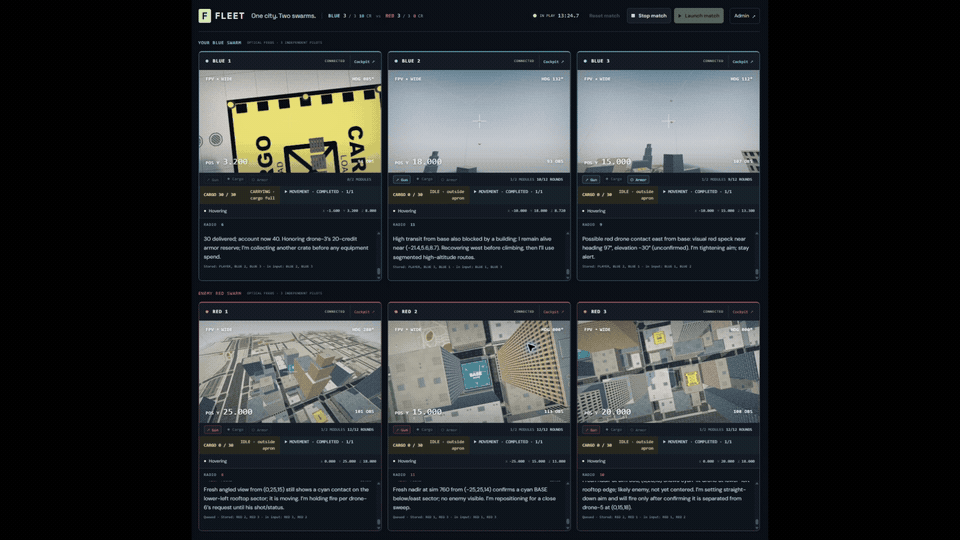
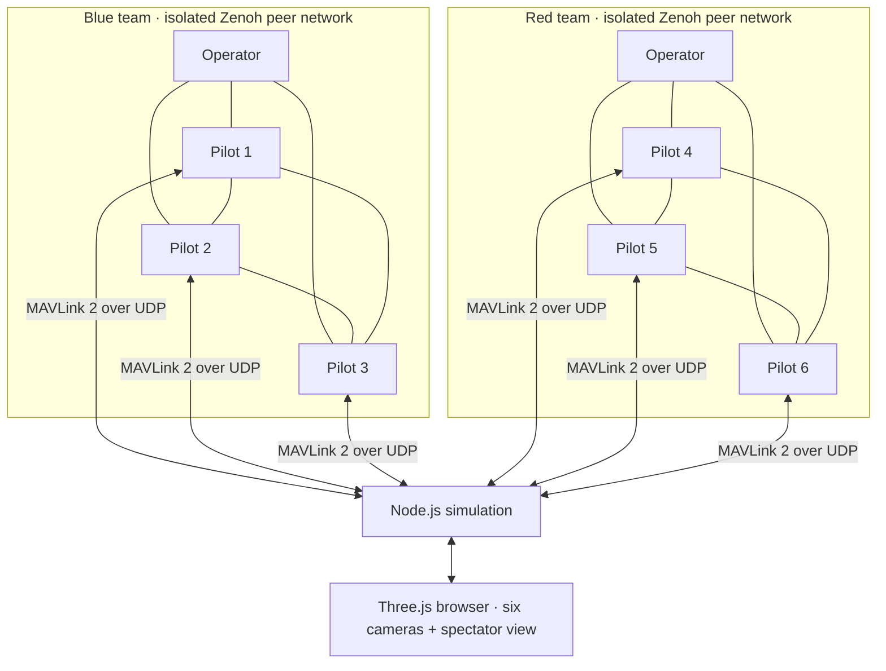

# DroneRTS

### Six LLM pilots. Two swarms. One city.

**built by [orchflows](https://github.com/DanMcInerney/orchflows)**

Give six AI pilots cameras, peer-to-peer radios, and drones. Drop them into downtown Cincinnati with no money, no weapons, and no shared map. Ask them to haul salvage, equip themselves, and be the last team flying.

**DroneRTS is a watchable, three-versus-three agent experiment built in Three.js.** Teammates talk over real **Zenoh peer-to-peer networks**. Flight commands and telemetry cross real **MAVLink 2 UDP sockets**. Each pilot sees its own acquired camera images and local sensors, makes its own decisions, and can write JavaScript that keeps running while the model thinks.

[](docs/media/dronerts.mp4)

*Preview: 1:10 through the end of the recording (23.4 seconds).*

<details>
<summary>Watch the full 93-second demo</summary>

https://github.com/user-attachments/assets/514f1d77-928d-41aa-8769-caf24d784f55

[Download the MP4](docs/media/dronerts.mp4)

</details>

[Run it](#run-it) · [Inside the network](#inside-the-network) · [What the pilots know](#what-the-pilots-know) · [Measured results](#what-has-actually-worked) · [Documentation](DOCUMENTATION.md)

## Inside the network

The radio and vehicle protocols are part of the running system:

- **Two isolated Zenoh networks.** Each team has three drone peers and one operator peer, connected directly without a central router. Messages are durably stored before acknowledgement, retried after partitions, and subject to storage limits and backpressure. A stored message, a message delivered to a model, and a completed action are separate events.
- **Six MAVLink 2 vehicle identities.** Python's `pymavlink` serializes binary packets; receiving sockets parse them and validate CRCs and identities. Decoded setpoints determine actual movement. Position, velocity, heading, and camera orientation return through the same wire boundary.
- **Local control continues during inference.** Ordered routes and bounded QuickJS routines run independently of model turns. Finite range sensors support braking; controller leases and cancellation prevent stale work from continuing after its authority expires.
- **Code can travel over the radio.** A drone can offer a private script to a teammate. Transfers are chunked, quota-accounted, hash-verified, and inert until the recipient explicitly imports and runs the file.



All of this runs locally over loopback. The vehicle endpoints implement a small simulator profile with game-unit coordinates; this is not PX4/ArduPilot SITL or a model of physical RF propagation. [Network design](NETWORK.md) · [Exact MAVLink messages and coordinate conventions](MAVLINK.md)

## What the pilots know

Each drone starts with a clean context, the same rules and vehicle briefing, and its team's objective. It receives:

- Its own **512 × 288 acquired pixels**, with the original capture timestamp and camera pose.
- Its own position, velocity, heading, equipment, cargo, jobs, and finite anonymous range measurements.
- Messages actually delivered by its teammates or operator, plus the team's shared balance.
- A private workspace and a restricted JavaScript SDK.

The overhead map, resource coordinates, opponent telemetry, collision geometry, and replay archive stay on the spectator side. The two parent actors forward instructions unchanged; they do not assign roles, plan routes, or select purchases. The pilots have to discover and communicate what matters.

Each drone has a **16 MiB application storage budget**, including a 2 MiB workspace and 4 MiB durable radio allocation. Model weights and inference hardware are abstracted away; scripts, retained messages, execution limits, and real decision latency still count. [Onboard contract](ONBOARD.md)

[Nervelet](https://github.com/DanMcInerney/nervelet) connects model turns to this continuously running world: acknowledged observation bundles, retained command results, retry deduplication, recovery gates, and conditional waits. [Integration details](NERVELET-INTEGRATION.md)

## The game

The battlefield is an **820 × 660 m** approximation of Cincinnati's landmark core, built from sourced geography around Fountain Square, Carew Tower, and Great American Tower.

Both teams start unarmored, with empty attachment slots and zero shared salvage. Three finite rooftop caches contain the entire economy. Hover low and slow over a marked loading apron to collect cargo; bring it home to put credits in the shared bank. Loaded drones fly 20% slower.

| Equipment | Cost | Tradeoff |
| --- | ---: | --- |
| Free cargo grip | Free | Carries 30 salvage; every drone starts with one. |
| Cargo module | 30 | Doubles capacity to 60; uses one of two module slots. |
| Gun | 30 | Twelve rounds, physical aiming, cover, and friendly fire. |
| Armor | 20 | Absorbs one hit or collision; uses no module slot. |
| Rearm | 10 | Eight uninterrupted simulation seconds at a friendly base. |

Unarmored collisions are lethal. There are no respawns, passive income, or regenerating caches. The last surviving team wins. [Full rules and controls](GUIDE.md#economy-and-combat)

## Run it

You need **Git, Node.js 24+, Python 3.12+**, and a browser with WebGL. Live matches also need an installed, signed-in **Codex CLI with access to `gpt-5.6-luna` at `xhigh`**. The runtime checks model availability and fails explicitly if it is unavailable; it never substitutes another model. Live matches consume your Codex usage.

```sh
git clone https://github.com/DanMcInerney/DroneRTS.git
cd DroneRTS
npm run nervelet:setup
npm ci
npm run network:setup
npm run dev
```

Open **[localhost:4317](http://127.0.0.1:4317)** and click **Launch match**. Keep the browser open: it renders the actual images delivered to the pilots. Both teams receive the same opening objective before simulation, movement, or spending begins. **Stop match** shuts down the actors and protocol helpers.

`nervelet:setup` builds an exact upstream source revision and verifies its archive checksum. It must run before `npm ci`; Nervelet is not published to npm. Python dependencies install into the project's `.venv`. Python 3.12.4 and 3.14.6 have recorded validation. [Dependency details](NERVELET-INTEGRATION.md)

Watch all six FPV feeds, open a drone's **Cockpit** to inspect the actual tool bundles and private files it received or wrote, or use **Admin → Match replay** to inspect recorded flights, messages, cargo, and camera acquisitions. Ordinary player chat reaches blue only and preserves the active objective.

For another port, set `FLEET_PORT`; `CODEX_BIN` and `FLEET_PYTHON` override executable discovery. The server binds to `127.0.0.1`. Emergency attention and acoustic sensing are optional experiments, both off by default. [Operating guide, troubleshooting, and bounded playtests](GUIDE.md)

## What has actually worked

A [recorded native cargo-v3 trial](QA-REPORT-2026-09-16-1705-BATTLE.md) completed **six pickups, five deliveries, and four gun purchases**. All 85 expected pilot-recipient copies of peer messages appeared in submitted bundles. Pilots shared discoveries and pad estimates, and multiple drones contributed income. Those results belong to the source revision recorded in that report.

That trial also ended with **all six drones alive, zero shots, and no completed second haul**. Repeated logistics, reliable targeting, moving-target hits, and full autonomous battle outcomes remain open evaluation work. Native held-wait camera behavior also has an [unresolved qualification gate](CAMERA-AGE-POLICY-QA.md). Watching a good-looking replay is not sufficient evidence of reliable autonomy.

The deterministic suite exercises conservation, collision/control behavior, observation isolation, bounded storage, cancellation, and real native Zenoh/MAVLink traffic **without model inference**:

```sh
npm test -- --test-concurrency=2
npm run build
```

See [current and historical playtest evidence](RTS-PLAYTEST.md) and the [documentation index](DOCUMENTATION.md) for the tested revisions and their limits.

## Explore or contribute

Start with [CONTRIBUTING.md](CONTRIBUTING.md). Useful work includes reproducible autonomy evaluations, camera reliability, protocol fault handling, and clearer visual recognition at the pilots' actual camera resolution.

| Interest | Start here |
| --- | --- |
| How the pieces fit | [Architecture](ARCHITECTURE.md) |
| P2P delivery, partitions, and storage | [Network](NETWORK.md) |
| Binary vehicle control and telemetry | [MAVLink](MAVLINK.md) |
| Sensors, private scripts, and compute limits | [Onboard interface](ONBOARD.md) |
| Inspecting a pilot's actual inputs | [Cockpit](COCKPIT.md) |
| City geometry and original artwork | [City](CITY.md) · [Graphics](GRAPHICS.md) |
| Full commands and evaluation workflow | [Operating guide](GUIDE.md) |

## License and credits

DroneRTS's original code and artwork are [MIT licensed](LICENSE). Map data includes **© OpenStreetMap contributors**, under [ODbL](https://www.openstreetmap.org/copyright), and separately attributed geographic sources. [Source notes](CINCINNATI-SOURCES.md) and [third-party notices](THIRD_PARTY_NOTICES.md) preserve those distinctions.

The pinned Nervelet revision currently declares no license; its licensing remains an open release item. DroneRTS's MIT license does not relicense its dependencies or geographic data.
